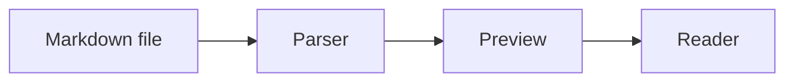

# Rich Markdown Preview Demo

This file exercises the Stage 1 external preview and the Stage 2 native Zed preview changes.
Open it in Zed, run the preview, then edit any text here to confirm live reload and native rendering.

## What Should Stand Out

- [x] GitHub-flavored task lists render as checkboxes.
- [ ] Unchecked tasks remain visible and aligned.
- Tables use GitHub-like spacing in Stage 1.
- Code blocks expose copy and wrap controls on hover in Stage 2.
- Local images are centered and constrained.
- Broken images show a visible placeholder instead of disappearing.

## Duplicate Heading

This first duplicate heading should get the slug `duplicate-heading`.

## Duplicate Heading

This second duplicate heading should get a deduplicated slug such as `duplicate-heading-1`.

### Nested Heading For Outline

Use `cmd-shift-o` or `ctrl-shift-o` in Zed to check whether Markdown headings appear in the native outline path.

| Feature | Stage 1 External Preview | Stage 2 Native Preview |
| --- | --- | --- |
| GFM tables | Yes | Existing parser support |
| Live reload | Server-Sent Events | Native editor updates |
| Mermaid | Browser-rendered | Existing Mermaid renderer path |
| Code controls | Browser code styling | Copy/wrap buttons on hover |
| Broken image UX | Browser missing image behavior | Placeholder text |

## Code Block

Hover this block in the native preview. You should see copy and wrap controls.

```rust
fn main() {
    let message = "This is intentionally long so the wrap control has something useful to do when the preview pane is narrow.";
    println!("{message}");
}
```

## Mermaid Diagram

Stage 1 loads Mermaid in the browser. Stage 2 uses Zed's existing Mermaid rendering path.



## Centered Local Image

The SVG below is intentionally wide. It should not overflow horizontally.


## Broken Image Placeholder

In the Stage 2 native preview, this missing image should render a bordered placeholder with text.


## Live Reload Check

Change this sentence while the Stage 1 browser preview is open. The page should reload shortly after saving.
